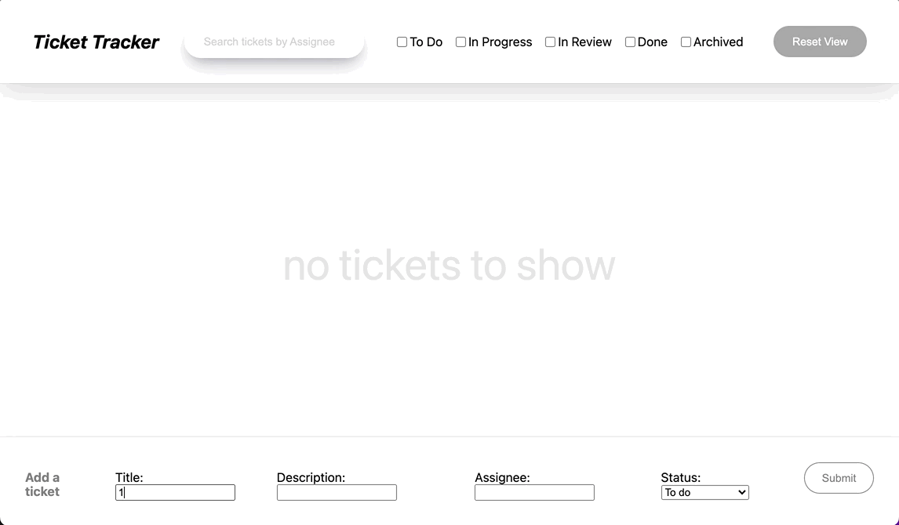

# Demo of Ticket Tracker app

Creating a ticket, searching, filtering, resetting view:

---

## Running

To run, make sure docker is running, then simply execute `docker-compose up`. This will create your environment and you can access the next app at [http://localhost:3000](http://localhost:3000).

## Starting from scratch

If you'd like to delete your work in the DB, you can run `make clean`. NOTE: This will delete everything in the database and will require you to run your migrations and create data again. use with caution!

## Migrations

### Creating a new migration

You can find the commands for using [sequelize migrations](https://sequelize.org/docs/v6/other-topics/migrations/). Ensure you run this command from within the `nextjs` folder.

### Running migrations (up)

From the base folder, run `make migrate`

### Running migrations (down)

From the base folder, run `make migrate/down`
